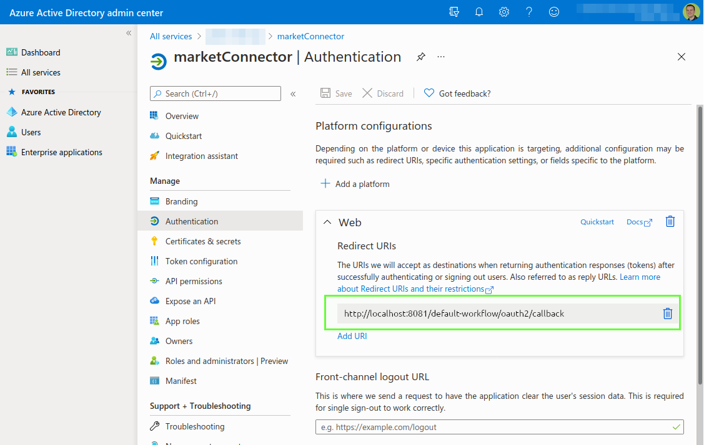
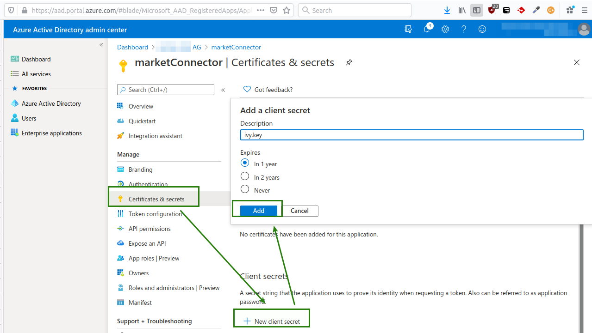
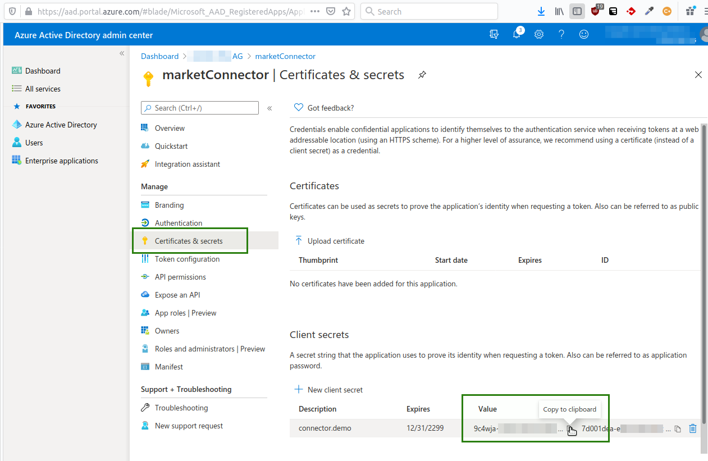
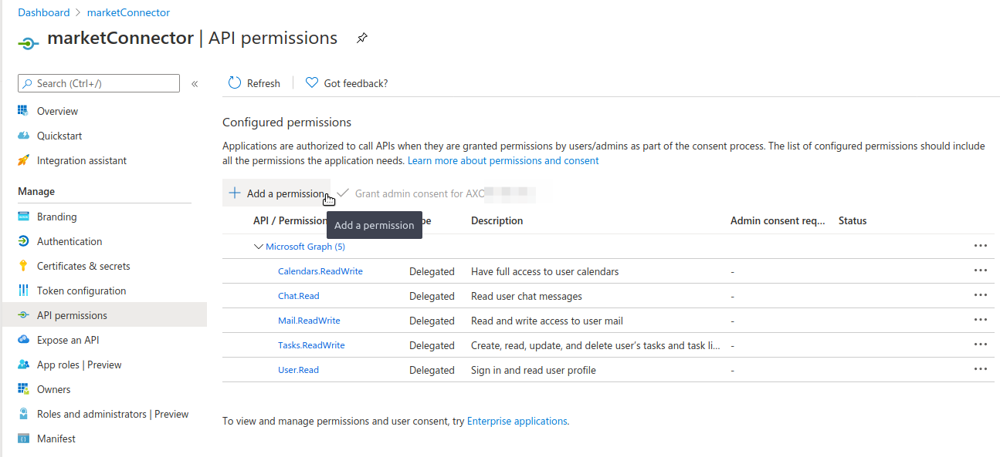

## Setup

1. Register an application on Azure as described in the Microsoft's Java Tutorial https://docs.microsoft.com/en-us/graph/tutorials/java?tutorial-step=2
1. Navigate to `Overview` in the menu and copy the 'Application (client) ID' into Rest Client Definition property `AUTH.appId`.
1. Navigate to `Authentication` in the Azure App menu.
	1. Add a `Redirect URI` in the `Web` Section.
		- Axon Ivy has an authentication callback URI which follows the pattern `{scheme}://{host}:{port}/{application}/auth/callback`. This URI must be registered in the Azure App.
		- Consequently, for the Axon Ivy Designer this URI can always be set to the following value: `http://localhost:8081/designer/auth/callback`
		- For the Axon Ivy Engine, the URI must contain the full URI where your application is reachable plus the callback path. E.g.: `https://my.workflows.ch/myApp/auth/calllback`
 

1. Navigate to `Certificate & secrets` in the Azure App menu.
    1. Create a new secret by pressing `New client secret`. And select any validity period.
    
	1. copy the value of the generated secret into Rest Client Definition property `AUTH.secretKey`.
	
1. Navigate to `API Permissions` in the Azure App menu.
Add permissions via `Add a permission` > `Microsoft Graph` > `Delegated permissions`
The following permission must be granted:
	- User.Read
	- Calendars.ReadWrite
	- Mail.ReadWrite
	- Tasks.ReadWrite
    

1. Done. Start any process that connects with Microsoft 365.
